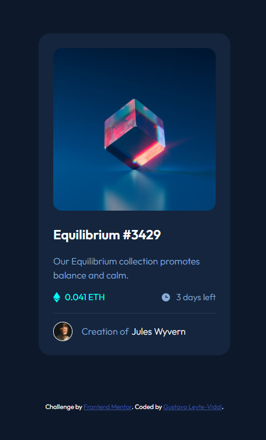

# Frontend Mentor - NFT preview card component solution

This is a solution to the [NFT preview card component challenge on Frontend Mentor](https://www.frontendmentor.io/challenges/nft-preview-card-component-SbdUL_w0U). Frontend Mentor challenges help you improve your coding skills by building realistic projects.

## Table of contents

- [Frontend Mentor - NFT preview card component solution](#frontend-mentor---nft-preview-card-component-solution)
  - [Table of contents](#table-of-contents)
  - [Overview](#overview)
    - [The challenge](#the-challenge)
    - [Screenshot](#screenshot)
    - [Links](#links)
  - [My process](#my-process)
    - [Built with](#built-with)
  - [Author](#author)

## Overview

### The challenge

Users should be able to:

- View the optimal layout depending on their device's screen size
- See hover states for interactive elements

### Screenshot

### Links

- Solution URL: [Frontend Mentor Solution](https://www.frontendmentor.io/solutions/sass-scss-react-js-E4JFyuXDSp)
- Live Site URL: [Live Site at Netlify](https://solution-nft-preview-card-component.netlify.app/)

## My process

### Built with

- Semantic HTML5 markup
- SASS Preprocessor
- Flexbox
- CSS Grid
- Mobile-first workflow
- [React](https://reactjs.org/) - JS library

## Author

- Website - [Github](https://github.com/gustavoylc)
- Frontend Mentor - [@gustavoylc](https://www.frontendmentor.io/profile/gustavoylc)
- Twitter - [@gustavoylc](https://www.twitter.com/gustavoylc)
